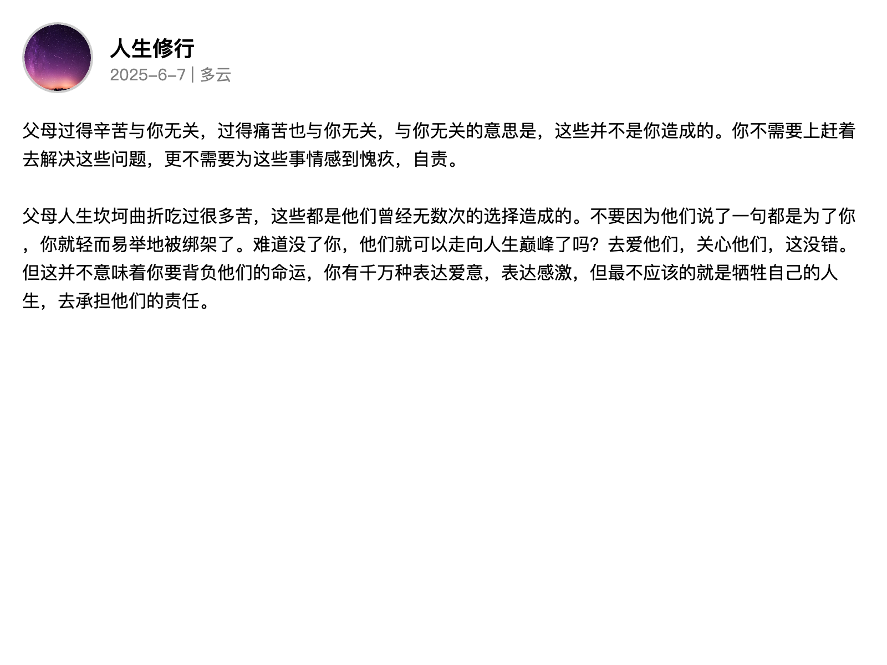

# 文字卡片生成器

一个简单的网页应用，可以生成带有头像、文字和背景的卡片。

## 功能特点

- 支持上传头像并进行圆形裁剪
- 支持上传背景图片
- 可选择显示日期和天气
- 支持多种卡片比例
- 一键下载生成的卡片

## 效果展示

## 使用方法

1. 输入名字
2. 上传头像（可选）
3. 上传背景图片（可选）
4. 输入文字内容
5. 选择是否显示日期和天气
6. 选择卡片比例
7. 点击"生成卡片"预览效果
8. 点击"下载卡片"保存图片
